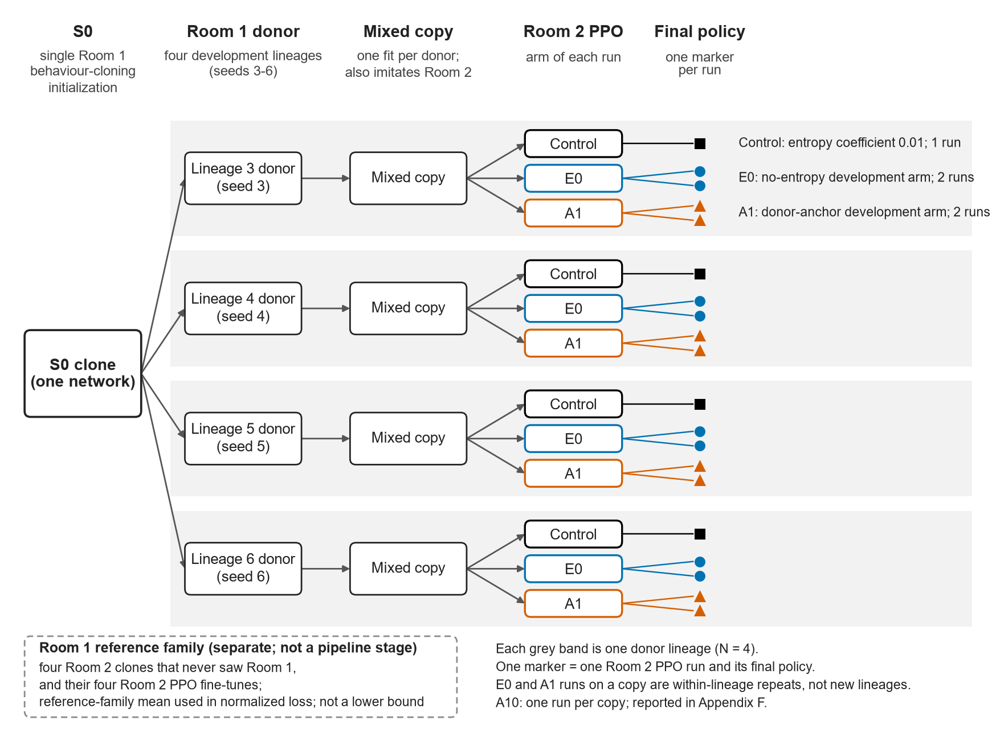
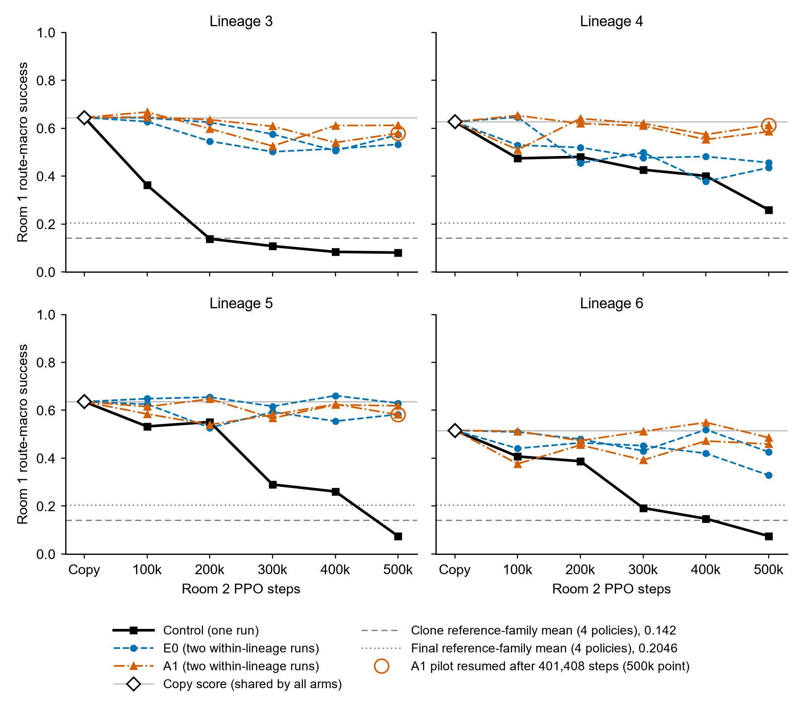

# Measuring competence and forgetting across imitation and PPO adaptation: a Celeste case study

**Muhammad Shihaab Alam**

*Technical report / worked empirical case study, version 1.0. 2026-10-09.*

*Evidence status: descriptive development evidence and attributed historical comparisons from one Celeste room pair. The retention analyses use four donor lineages sharing one behaviour-cloning initialization and one demonstration set.*

## Abstract

Measuring old-task competence loss during adaptation depends on the reference checkpoint, evaluation distribution, denominator and unit of replication. This report examines those choices in an imitation-plus-proximal-policy-optimization (PPO) pipeline in Celeste. Four donor lineages share one Room 1 behaviour-cloning initialization. Each donor is fitted into a mixed copy that imitates both the donor's Room 1 outputs and Room 2 demonstrations, then adapted with Room 2 PPO. Observed Room 1 route-macro success fell roughly 12-14 percentage points across the mixed-copy step, which also learns Room 2, and a further roughly 37-56 points during PPO under the control recipe. The no-entropy development arm (E0) and donor-anchor development arm (A1) lost much less than one earlier control run per lineage, although their cross-campaign comparison is descriptive. Their observed median Room 2 outcomes were not below the control's; these cross-campaign results do not identify a Room 2 cost or benefit. A post hoc near/far-at-reset analysis shows why subgroup starting baselines and start distributions matter: E0 also had much smaller far-at-reset decay than the earlier control, and the data do not identify A1-versus-E0 protection scope. Far at reset does not mean unexposed during subsequent play. Evaluation reuse, shared ancestry and single stochastic evaluations limit interpretation. These data do not identify mechanism or support population-level generalization. The contribution is a worked measurement case within one pipeline, with no new algorithmic claim.

## 1. Motivation and question

### 1.1 Why forgetting is hard to measure

Adapting a competent reinforcement-learning policy to a new task can degrade its competence on the old one. Measuring that degradation sounds simple: score the policy on the old task before and after adaptation and take the difference. In practice the answer depends on which checkpoint supplies the baseline, how the old task is sampled, how scores are weighted, what supplies the reference value and which source of randomness is replicated.

Prior work has shown that the choice of forgetting measure can change which method appears to forget less (Ashley et al. 2021), and that few-run reinforcement-learning results are easy to overread (Agarwal et al. 2021; Colas et al. 2018). Fine-tuning a pretrained policy is itself a forgetting problem, whose size depends on which states are visited (Wołczyk et al. 2024). This report works through one pipeline in which those choices change the interpretation of the available measurements.

The bounded question is: where does measured Room 1 competence loss sit across mixed imitation and Room 2 PPO, and what do those measurements identify about retention when their baselines and evaluation distributions are made explicit?

### 1.2 Why this room pair

Celeste's first two rooms give a small setting with clear success criteria. Room 1 success means leaving the room; its frozen development set contains 200 starts drawn from 11 routes. Room 2 has a different layout, its own demonstrations and its own frozen start set. Both run in the same deterministic game with the same observation and action interface, allowing Room 1 competence to be scored on the same starts at every stage.

Room 1 was learned from search-generated demonstrations. A declared no-demonstration PPO recipe produced zero Room 1 clears within its fixed budget across three seeds ([docs/phase3-unshaped-baseline.md](https://github.com/shihaab453/celeste-rl/blob/b718d5b1bf4ae64a9e23e280000ecd03354391e0/docs/phase3-unshaped-baseline.md)). That result is bounded to the recipe and budget, rather than a claim that demonstrations are necessary for learning the room.

### 1.3 Retrospective framing and sources

The two cases were selected retrospectively because, in each, a measurement choice changes the interpretation. They are worked examples selected for that property, rather than a sample of project analyses. The report cannot estimate how often these issues would change conclusions elsewhere. Later follow-up studies were designed but stopped before collecting outcome data, so they provide no additional empirical result.

This report runs no new training, policy evaluation or statistical test. Empirical values come from published repository aggregates and reports; derived quantities are arithmetic already used in the stage and distribution analyses. Appendix A gives the public source map, and Appendix B gives the formulas. Appendix A links these sources at immutable public commits.

Sections 2 and 3 define the pipeline and measurements. Sections 4 and 5 work through the stage-resolved and evaluation-distribution cases. Sections 6-9 discuss identification, reporting, limitations and the bounded conclusion.

---

## 2. Experimental pipeline and units

### 2.1 The pipeline

Every retention measurement refers to one of five stages, starting from the shared Room 1 behaviour-cloning initialization (S0):

```
S0 clone  ->  donor (D)  ->  mixed copy (C)  ->  Room 2 PPO  ->  final policy (F)
```

- **Shared initialization (S0).** The single Room 1 behaviour-cloning network. It was fitted on 5 of 7 complete Room 1 clears found by a Go-Explore style search; no human play was involved, and two demonstrations were held out.
- **Donor.** A 500k-step PPO fine-tune of S0 with varied starts and success sampling (the varied-start Room 1 fine-tuning recipe; section 2.2).
- **Mixed copy.** A policy fitted from the donor's weights to two targets at once:

  - the donor's own Room 1 action probabilities on its recorded play;
  - the Room 2 demonstrations.

  Both rooms are weighted equally, all weights are free, and the fit runs for 300 epochs (the mixed self-distillation fit in the public retention report). Older public reports and result files call these copies "clones"; this report calls them copies throughout.
- **Room 2 PPO.** 500k requested steps of PPO on Room 2 from the copy, with the canonical Room 2 start and a stall ending. The main comparisons use three arms:

  - control: entropy coefficient 0.01, no anchor;
  - no-entropy development arm (E0): entropy coefficient 0, no anchor;
  - donor-anchor development arm (A1): entropy 0.01 plus a weight-1 anchor to the frozen donor's Room 1 button probabilities on recorded donor play.

  A higher-weight anchor variant is tabulated in Appendix F.
- **Final.** The policy at the last checkpoint of a Room 2 PPO run. Checkpoints were saved every 100k steps.

[](figures/technical-report/F1-lineage-stage-diagram.svg)

*Figure F1. Lineage and stage structure.* One behaviour-cloning network, the S0 clone, is fine-tuned into four development donors, so all development donors share S0; each grey band is one donor lineage. Each donor has one mixed copy, fitted to the donor's Room 1 behaviour and, in the same fit, to the Room 2 demonstrations, so the mixed-copy stage also imitates Room 2. Each copy is fine-tuned on Room 2 once under the control and twice each under E0 and A1. The two E0 runs and the two A1 runs are within-lineage repeats on that same copy, not additional donor lineages, so N = 4. A higher-weight anchor variant (A10) also ran once per copy; it is omitted from this figure and reported in Appendix F. The dashed box is the reference family behind the normalized losses: four Room 2 clones that never saw Room 1, and their four Room 2 PPO fine-tunes. Its mean is a reference value, not a lower bound. Public provenance and execution notes are in Appendix H.

### 2.2 Who descends from whom

**All Room 1 donors descend from S0.** There is exactly one Room 1 clone, so variation that would come from refitting the clone was never sampled. The four lineages therefore understate how different a fresh run of the whole recipe could be.

**The development donors come from an earlier Room 1 comparison.** The public demonstration-comparison report calls this comparison Phase 3B ([docs/phase3b-demonstration-comparison.md](https://github.com/shihaab453/celeste-rl/blob/b718d5b1bf4ae64a9e23e280000ecd03354391e0/docs/phase3b-demonstration-comparison.md)). It was a predeclared comparison of two Room 1 fine-tuning recipes from S0, canonical starts (arm A) and varied starts (arm B), over six training seeds (section 5.3). The four development donors are its arm B checkpoints for seeds 3 to 6: their Room 1 route-macro scores (0.7643, 0.7691, 0.7735, 0.6593) are exactly the arm B scores for those seeds in the earlier Room 1 start-distribution comparison. That comparison and the retention evidence are therefore views of the same checkpoints, not independent evidence.

**Repeated runs on one copy are not new lineages.** A tie-break later ran a second batch of E0 and A1 on the same copies. It doubled the runs per arm from four to eight; the number of lineages stayed at four.

### 2.3 Independent units

An independent unit is a fresh draw of the randomness that a claim is about. Randomness enters at several nested levels.

**Table T0. Levels of randomness and what counts as N.** Rows run from the outermost level inwards. Only the donor PPO seed supplies independent units for donor-level claims.

| Level | What a new draw would be | What exists | N for donor-level claims? |
| --- | --- | --- | --- |
| Shared initialization | a second Room 1 clone | one S0 clone | not sampled |
| Donor PPO seed | a new PPO fine-tune of S0 | 4 development donors (seeds 3-6) | **yes, N = 4**, sharing S0 and the demonstration set |
| Copy fit | a second copy of the same donor | one copy per donor | not sampled |
| Within-lineage repeat | another Room 2 PPO seed on the same copy | E0 and A1: 2 runs per copy; control and A10: 1 | no |
| Evaluation | another stochastic pass over the starts | one episode per start, one evaluation seed per room | no; precision of one policy's score |
| Starts, routes, frames | more states from the same set | 200 starts on 11 routes | no |

Conditional on S0 and the shared recipe, the four development donors are separate PPO fine-tunes with distinct seeds. They sample donor-training randomness. They do not sample initialization, demonstration-set or recipe randomness, and that level can be large: the canonical-start arm in the earlier Room 1 start-distribution comparison ranged from 5.5% to 72.5% route-macro across seeds. The evidence therefore does not collapse to N = 1, but a mean over donors has four data points, however many episodes sit behind each. Episode counts in source reports describe measurement precision, never replication.

### 2.4 The reference family

The reference means in section 3.2 come from four 21-route Room 2 clones that never saw Room 1, and their four Room 2 PPO fine-tunes. They were used in a later replicated-clone route-set experiment ([docs/room2-training-stability.md](https://github.com/shihaab453/celeste-rl/blob/b718d5b1bf4ae64a9e23e280000ecd03354391e0/docs/room2-training-stability.md)). These policies overlap with Room 2 policies used elsewhere in the project (Appendix H); no count or conclusion here depends on that overlap.

---

## 3. Measurement definitions

This section defines the scores, reference values, sampled starts and the scale of single-evaluation noise.

### 3.1 Scores

All Room 1 scores are measured on the **Room 1 v1 development set**: 200 frozen start states on 11 routes, one stochastic episode per start, evaluation seed 20260920. A start succeeds when the episode leaves the room.

- **Route-macro success** averages the success rate over the 11 routes with equal weight per route. It is the primary score.
- **State-weighted success** counts every start equally.

**D**, **C** and **F** denote the route-macro scores of a donor, its copy and a final policy, all on this set.

The set is a development set, not a fresh one. It carried the corrected earlier Room 1 start-distribution comparison, five retention pilots, the arm tie-break and the post hoc analyses, and later analyses were chosen after earlier ones had been seen.

### 3.2 Reference-family means and loss quantities

The normalized losses use a **reference-family mean**: the mean Room 1 score of policies that never saw Room 1. The public result files call it a floor; Appendix D maps that terminology to the source keys.

- **Clone reference-family mean, 0.142:** the mean of the four Room 2 clones (individual scores 0.1042 to 0.1738).
- **Final reference-family mean, 0.2046:** the mean of their four Room 2 PPO finals (0.1197 to 0.2973).

The mean is a reference value, **not a lower bound**. It measures whatever Room 1 competence transfers from Room 2 training.

Losses are expressed in units of the donor's margin over the clone reference-family mean, `D - 0.142`:

| Quantity | Formula | What it measures | Value at zero final success |
| --- | --- | --- | --- |
| Mixed-copy-stage loss | `(D - C)/(D - 0.142)` | loss between donor and copy | not applicable |
| PPO-stage loss (the pilots' declared loss) | `(C - F)/(D - 0.142)` | loss during Room 2 PPO, from the copy | `C/(D - 0.142)`, 0.998-1.036 here |
| Donor-to-final loss | `(D - F)/(D - 0.142)` | loss across the whole pipeline after the donor | `D/(D - 0.142)`, 1.225-1.274 here |

The first two quantities sum exactly to the third. A loss of 0.25 means a quarter of the donor's margin over the reference-family mean, not 25 percentage points. A donor-to-final loss above 1 means the final scored below the reference-family mean. Percentage points and normalized units are never mixed in one column.

The mixed-copy stage is named for its position in the pipeline, not for a mechanism. The fit starts from donor weights and fits the donor's Room 1 soft targets **and** the Room 2 demonstrations at the same time. Its boundary therefore does not isolate imitation infidelity from the concurrent Room 2 objective.

### 3.3 Evaluation distributions

Room 1 scores on different distributions are different quantities:

- **Canonical-start success** is success from the room's normal starting position. It measures competence at one state.
- **200-start success** samples states along 11 routes. It is closer to room-wide competence.
- **Near at reset** and **far at reset** split the 200 starts by whether the start position, at reset, lies within 4 pixels (inclusive) of a frame the copy was fitted on with the same dash count.

"Far at reset" is a property of the start, not of the trajectory that follows. A far-at-reset start can later join recorded paths, so "far at reset" does not mean unexposed to rehearsal. Starts within 4 pixels make up 59-76% of the set, depending on the lineage.

Every success score here is **closed loop**: the policy acts in the game and samples its actions. Open-loop agreement on fixed recorded frames is a different quantity (Ross et al. 2011; Codevilla et al. 2018).

### 3.4 Noise scale

Each policy was evaluated once. No interval or test is computed in this report; historical intervals are quoted only where the original report published them.

As a rough single-evaluation scale, not an interval: the binomial standard error of one 200-start evaluation at 60% success is about 3.5 points. At the copy scores (0.52-0.64) and donor margins (0.52-0.63) here, that is about 0.05 to 0.07 normalized loss units. The copy's single evaluation is the baseline for every arm on its lineage, so its error shifts all of that lineage's PPO-stage losses together.

---

## 4. Stage-resolved competence loss

*Evidence: development (descriptive pilots with plans declared before data, on the reused development set). N = 4 lineages. Sources: [docs/results/mixed-self-distillation-clone.json](https://github.com/shihaab453/celeste-rl/blob/b718d5b1bf4ae64a9e23e280000ecd03354391e0/docs/results/mixed-self-distillation-clone.json), [mixed-self-distillation-ppo.json](https://github.com/shihaab453/celeste-rl/blob/b718d5b1bf4ae64a9e23e280000ecd03354391e0/docs/results/mixed-self-distillation-ppo.json), [ppo-anchor-pilot.json](https://github.com/shihaab453/celeste-rl/blob/b718d5b1bf4ae64a9e23e280000ecd03354391e0/docs/results/ppo-anchor-pilot.json), [ppo-anchor-tiebreak.json](https://github.com/shihaab453/celeste-rl/blob/b718d5b1bf4ae64a9e23e280000ecd03354391e0/docs/results/ppo-anchor-tiebreak.json), [retention-pilot.json](https://github.com/shihaab453/celeste-rl/blob/b718d5b1bf4ae64a9e23e280000ecd03354391e0/docs/results/retention-pilot.json); derived quantities are arithmetic on these (Appendix A).*

### 4.1 Two legitimate loss quantities

The retention pilots declared the PPO-stage loss, counted from the copy. That is the right choice for comparing arms, because every arm on a lineage starts from the same copy. It answers a specific question: what did Room 2 PPO do to the copy's Room 1 competence?

A different and equally legitimate question is how much of the donor's competence the whole pipeline delivered. The donor-to-final loss answers that. The historical reports did not compute it for the remedy arms. This case sets the two quantities side by side; it does not correct any historical calculation.

### 4.2 The stage table

**Table T1. Room 1 competence at each stage, by lineage.** Raw route-macro scores on the Room 1 v1 development set come first, then losses in normalized donor-margin units (reference mean 0.142). For E0 and A1, "a / b" gives two within-lineage repeats on the same copy: a is the pilot run and b the tie-break run. The last column gives Room 2 v1 route-macro for the same finals. Read across a row to see where each lineage's loss sits.

| Lineage | D | C | Mixed-copy-stage loss | Control F | Control PPO-stage loss | E0 F (a / b) | E0 PPO-stage loss (a / b) | A1 F (a / b) | A1 PPO-stage loss (a / b) | Room 2 v1 route-macro: control; E0 a, b; A1 a, b |
| ---: | ---: | ---: | ---: | ---: | ---: | --- | --- | --- | --- | --- |
| 3 | 0.7643 | 0.6447 | 0.192 | 0.0807 | 0.906 | 0.5724 / 0.5325 | 0.116 / 0.180 | 0.5786 / 0.6118 | 0.106 / 0.053 | 0.769; 0.917, 0.864; 0.861, 0.836 |
| 4 | 0.7691 | 0.6265 | 0.227 | 0.2590 | 0.586 | 0.4354 / 0.4564 | 0.305 / 0.271 | 0.6132 / 0.5857 | 0.021 / 0.065 | 0.851; 0.833, 0.861; 0.845, 0.762 |
| 5 | 0.7735 | 0.6358 | 0.218 | 0.0746 | 0.889 | 0.6295 / 0.5829 | 0.010 / 0.084 | 0.5814 / 0.6190 | 0.086 / 0.027 | 0.844; 0.872, 0.798; 0.872, 0.874 |
| 6 | 0.6593 | 0.5161 | 0.277 | 0.0748 | 0.853 | 0.3286 / 0.4261 | 0.363 (c) / 0.174 | 0.4859 / 0.4590 | 0.058 / 0.110 | 0.759; 0.842, 0.879; 0.775, 0.849 |
| **Median** | | | 0.223 (4 lineages) | | 0.871 (4 runs, 4 lineages) | | 0.177 (8 runs on 4 lineages) | | 0.062 (8 runs on 4 lineages) | control 0.806 (4 runs); E0 0.862, A1 0.847 (8 runs each) |

*Footer.* Descriptive, closed-loop, stochastic, one episode per start; evaluation seeds 20260920 (Room 1) and 20260922 (Room 2 v1). Independent unit: lineage, N = 4. The control runs come from an earlier, sequential campaign. The E0 and A1 medians are the published tie-break values 0.1771 and 0.0617. (c) Published as 0.3625, computed from unrounded scores; the four-decimal scores shown give 0.362. The PPO-stage loss and the reference means were declared before the pilots; the mixed-copy-stage column is retrospective arithmetic. Reference means apply to the full set only. Appendix F gives the full per-run table, with A10, Room 2 canonical clears and donor-to-final losses.

[](figures/technical-report/F2-room1-checkpoint-trajectories.svg)

*Figure F2. Room 1 competence during Room 2 PPO.* Each of the four panels is one donor lineage. Within a panel every arm starts from the same copy, shown by one shared marker and a light horizontal line at the copy score. The control is one run. E0 and A1 are each drawn as two thin lines of the same style: the two within-lineage runs on that copy, not independent donor lineages. Each point is a single stochastic evaluation of one checkpoint on the same 200 starts of the Room 1 development set, at the copy and at 100k to 500k steps; no uncertainty bars or arm-mean curves are drawn. The dashed and dotted lines are the clone and final reference-family means (four policies each; 0.142 and 0.2046), reference values rather than intervals or lower bounds. Rings mark the 500k points of the pilot A1 runs on lineages 3-5, which were resumed after 401,408 steps. A10 is omitted from the main figure and remains tabulated in Appendix F. Descriptive development evidence.

### 4.3 The mixed-copy stage lowers Room 1 competence before Room 2 PPO

Before any Room 2 PPO, the copies already scored 11.96, 14.26, 13.77 and 14.32 points below their donors. That is 0.192 to 0.277 of the donor margin, or a retained share, `(C - 0.142)/(D - 0.142)`, of 0.72 to 0.81. The loss is present in all four lineages and varies between them.

The stage does not support calling this a copying loss. The mixed fit also imitates the Room 2 demonstrations in the same fit, starting from the donor's weights, so the Room 1 loss could come from imitation infidelity, from interference by the Room 2 objective, or from both. "Before Room 2 PPO" is also not "before Room 2 learning".

As context only: Room 1-only students, fitted from fresh weights to the same donors' play, scored above the mixed copies by +4.75, +10.88, +19.62 and +4.68 points. That gap is compatible with part of the stage loss coming from the Room 2 objective. It is not a decomposition, for three reasons:

- the Room 1-only and mixed fits differ in both initialization and objective;
- each cell is a single fit;
- in lineage 5 the Room 1-only student scored 5.9 points above its own donor (0.8320 against 0.7735), so its gap exceeds the whole donor-to-copy loss.

An earlier pilot found that imitating Room 2 alone, from the donor's weights with all weights free, reduced Room 1 retained share to 0.02 to 0.12 before any PPO. That pilot used a different recipe from the mixed-copy fit.

### 4.4 Room 2 PPO under the control recipe

Under the control recipe, Room 2 PPO lowered Room 1 success from the copy by 56.4, 36.8, 56.1 and 44.1 points: PPO-stage losses of 0.906, 0.586, 0.889 and 0.853, median 0.871. Across the whole pipeline the control lost 51.0 to 69.9 points from the donor.

Three control finals were at or slightly below the lowest of the measured never-saw-Room-1 policies. They scored 0.0807, 0.0746 and 0.0748, which is 17, 15 and 16 successes of 200. The gap to the lowest reference policy (0.1042, 21 successes) was only 4-6 successes out of 200, on the scale of a single stochastic evaluation. Two further facts limit how much weight this can bear:

- each reference family contains four policies;
- the final family is the same four clones after fine-tuning, not four additional independent references.

The useful point is that a reference-family mean is not a lower bound. The donor-to-final losses for those three lineages (1.099, 1.107 and 1.130) say that the finals scored below the reference-family mean. The only hard bound is zero success. The PPO-stage loss cannot exceed `C/(D - 0.142)`, which is 0.998 to 1.036 here, and the control's losses reach 59% to 88% of that ceiling.

The control did learn Room 2. Its finals cleared the canonical Room 2 start in 44, 46, 41 and 35 of 50 episodes, and scored 0.759 to 0.851 on the Room 2 v1 set. These are four lineages under one recipe and one room pair; they do not estimate a collapse rate for PPO fine-tuning in general.

### 4.5 E0 and A1 lost much less than the control

E0 lost 0.010 to 0.363 of the donor margin across eight runs, and A1 lost 0.021 to 0.110. The largest loss in any of these sixteen runs (0.3625) is below the smallest control loss (0.5860).

These development runs are compared with one control run per lineage from an earlier, sequential campaign. The comparison is descriptive, not a controlled effect.

**Room 2 at the arm level.** The arm medians of E0 and A1 were not below the control's on either reported Room 2 measure:

**Room 2 outcomes, arm medians** (control: 4 runs; E0 and A1: 8 runs each on 4 lineages).

| Measure | Control | E0 | A1 |
| --- | ---: | ---: | ---: |
| Canonical clears of 50, median | 42.5 | 49 | 48 |
| Room 2 v1 route-macro, median | 0.806 | 0.862 | 0.847 |

**Room 2 run by run.** The picture is mixed:

- on Room 2 v1, 4 of the 16 E0 and A1 runs scored below their own lineage's control, by 0.6 to 8.9 points (lineages 4 and 5);
- on canonical clears, 1 of 16 did: the A1 pilot on lineage 3, with 40 clears against 44.

The two Room 2 measures can disagree, both use reused development sets, and the control comes from a different campaign. These data therefore do not identify a Room 2 cost or benefit of either variant.

### 4.6 Where A1's end-to-end shortfall sits

Every arm on a lineage started from the same copy, so all arms on that lineage share its mixed-copy-stage loss of 0.19 to 0.28. For A1, the PPO-stage loss (approximately 0.02-0.11) was smaller than that shared mixed-copy-stage loss in every development run.

Read from the donor, then, most of A1's end-to-end shortfall was already present at the copy. A1's donor-to-final loss was 0.245 to 0.387, pooled median 0.295. This statement is about where along the pipeline A1's measured loss sits, given its small PPO-stage loss. It does not associate A1 with the earlier loss: every arm shares that loss, and it occurred before any arm ran. For comparison, E0's PPO-stage loss exceeded the mixed-copy-stage loss in 3 of 8 runs, and the control's in all four.

Two qualifications apply. First, the mixed-copy stage includes Room 2 imitation (section 4.3). Second, there is one copy fit per donor, so a different fit could shift every arm's donor-based numbers.

A1's anchor targets the donor's outputs, not the copy's, so in principle A1 could recover mixed-copy-stage loss and finish above its copy. No final A1 checkpoint did. At intermediate checkpoints A1 exceeded its copy 6 times out of 32, by +0.16 to +3.32 points, which is within the single-evaluation scale.

### 4.7 Why both quantities are worth reporting

**The PPO-stage loss** isolates the Room 2 PPO step. It is the right quantity for comparing arms that share a copy, because the starting score cancels in any difference between two arms.

**The donor-to-final loss** describes what the whole pipeline delivered, mixing two stages with different objectives.

Single-arm readings depend on the starting checkpoint. A1's pooled median would sit above the pilots' historical 0.25 screening line if counted from the donor (0.295), and well below it if counted from the copy as declared (0.062). This only illustrates a screening line applied to a quantity it was never declared for; no declared screen is re-run or revised here.

The denominator matters too. If the copy's own margin `(C - 0.142)` replaced the donor's, every within-lineage contrast would be multiplied by 1.238, 1.294, 1.279 and 1.383 for the four lineages. Ordering within a lineage is unchanged, but magnitudes are not comparable across denominators. A retention statement in this pipeline must therefore name its starting checkpoint and its denominator.

### 4.8 Relation to prior work

The mixed-copy stage is not a clean instance of the "imperfect cloning gap" that Wołczyk et al. (2024) name as one driver of forgetting when a pretrained policy is fine-tuned with RL, because it also imitates Room 2. Distillation work routinely compares student with teacher (Rusu et al. 2016; Stanton et al. 2021). What this case adds is a quantified stage table built from one pipeline's own data.

---

## 5. Distribution and subgroup interpretation

*Evidence: development, post hoc (near/far at reset); historical predeclared comparison (the earlier Room 1 start-distribution comparison; original inference attributed, not re-run). N = 4 lineages for near/far; 6 training seeds from S0 for the earlier comparison. Sources: [docs/results/clone-near-far.json](https://github.com/shihaab453/celeste-rl/blob/b718d5b1bf4ae64a9e23e280000ecd03354391e0/docs/results/clone-near-far.json), [control-near-far.json](https://github.com/shihaab453/celeste-rl/blob/b718d5b1bf4ae64a9e23e280000ecd03354391e0/docs/results/control-near-far.json), [ppo-tiebreak-near-far.json](https://github.com/shihaab453/celeste-rl/blob/b718d5b1bf4ae64a9e23e280000ecd03354391e0/docs/results/ppo-tiebreak-near-far.json), [phase3b-heldout-ab-200.json](https://github.com/shihaab453/celeste-rl/blob/b718d5b1bf4ae64a9e23e280000ecd03354391e0/docs/results/phase3b-heldout-ab-200.json); derived quantities are arithmetic on these (Appendix A).*

### 5.1 Why the start distribution belongs in a forgetting report

The stage analysis showed that a loss depends on its starting checkpoint. It also depends on which starts are scored. Every normalized retention loss here uses D, itself a score on a chosen start distribution. If competence were read from the canonical start instead of the 200-start set, the donor reference, the copy baseline and every loss would describe a different quantity.

### 5.2 Near and far at reset

After A1 was selected, the 200 Room 1 starts were split into near and far at reset (section 3.3). The analysis is post hoc on the reused development set, and no subgroup-specific floor exists.

Read from final scores alone, the split invites a clear story: A1 minus E0 is +9.3 points near and +0.8 far at reset (route-balanced; pooled state-weighted +9.6 and +2.5), as if A1's advantage over E0 were local to the states the anchor rehearses. Table T3 adds what that reading leaves out: each subgroup's starting score at the copy, and a comparator that actually decayed in the subgroup.

**Table T3. Room 1 success and decline near and far at reset.** Copy baselines are success percentages; losses are copy minus final in percentage points. Compare each arm's loss with its own baseline, and the remedies' far-at-reset losses with the control's.

| Lineage | Starts near / far at reset | Copy baseline near | Copy baseline far at reset | Control loss near | Control loss far at reset | E0 loss near | E0 loss far at reset | A1 loss near | A1 loss far at reset |
| ---: | ---: | ---: | ---: | ---: | ---: | ---: | ---: | ---: | ---: |
| 3 | 118 / 82 | 69.7 | 58.1 | 61.7 | 48.5 | 14.6 | 2.5 | 5.1 | 4.9 |
| 4 | 152 / 48 | 68.1 | 43.1 | 39.6 | 26.3 | 22.2 | 6.9 | 6.5 | -1.0 |
| 5 | 121 / 79 | 69.8 | 53.7 | 57.7 | 53.7 | 6.0 | -1.1 | 4.4 | 1.0 |
| 6 | 146 / 54 | 56.4 | 35.4 | 47.7 | 32.3 | 16.2 | 4.7 | 5.9 | 4.7 |
| **Route-balanced mean** | 537 / 263 | **66.0** | **47.6** | **51.7** | **40.2** | **14.7** | **3.2** | **5.5** | **2.4** |
| Pooled state-weighted | | | | 50.1 | 43.3 | 13.5 | 4.9 | 3.9 | 2.5 |

*Footer.* Percentage points, not normalized units. Route-balanced means weight routes equally within each subgroup, then lineages equally. E0 and A1 losses average two within-lineage repeats; the control is one run per lineage from an earlier campaign. N = 4 lineages. Far-at-reset groups are thin: one episode can move a run's far-at-reset score by about 9 points. Per-run far-at-reset losses range from -2.5 to +7.7 for A1 and from -5.6 to +13.4 for E0, and far-at-reset A1 minus E0 changes sign between batches (route-balanced -0.6 pilot, +2.2 tie-break). No subgroup floors. Development, post hoc.

The same split supports three readings.

**Finals only.** As above, the finals alone suggest that A1's edge is local to rehearsed states.

**Loss from each copy baseline.** A1 lost 5.5 points near and 2.4 far at reset; E0 lost 14.7 near and 3.2 far at reset. E0 barely decayed far at reset, so there was almost nothing there for A1 to prevent relative to E0. The small far-at-reset gap cannot distinguish "A1 protects only near states" from "neither arm lost much far at reset". **A1-versus-E0 protection scope is not identifiable from these data.**

**With the control.** The control is one run per lineage from an earlier, sequential campaign, and it is the only comparator in these data that decayed far at reset. Its route-balanced far-at-reset success fell from 47.6% to 7.4%, a loss of 61% to 100% of its starting far-at-reset success per lineage. Both remedies showed much smaller far-at-reset losses: A1 lost 2.4 points, and E0, which has no rehearsal term, lost 3.2. The far-at-reset result therefore does not isolate an anchor-specific effect. Both an anchored and an unanchored arm showed small far-at-reset losses relative to the earlier control; these data do not identify why.

Nothing here shows that A1 protects behaviour beyond rehearsal exposure, and nothing shows that it protects only rehearsed states. A protection-scope claim would need three things:

- a subgroup defined by what the policy was exposed to along its trajectory;
- a comparator that decays in that subgroup;
- a subgroup floor.


The closest prior work measures retention on states that fine-tuning visits rarely ("Far" states) and finds that behaviour-cloning-style retention protects them (Wołczyk et al. 2024). Its Far states are defined by fine-tuning visitation, not by distance from fitted frames at reset, so the framings are related but not identical. This case applies known reasoning about subgroup baselines and comparators; it is not a finding about rehearsal.

### 5.3 Canonical-start versus 200-start competence

The same lesson appears at the acquisition stage. In the earlier Room 1 start-distribution comparison, four canonical-start (arm A) Room 1 runs reached 92-94% success from the canonical start, while some varied-start (arm B) runs scored 62% and 68% there. On the 200-start set, arm B exceeded arm A in all six matched PPO seeds: route-macro 74.8% against 52.2%, with seed differences from +2.2 to +71.4 points. The original report gave an interval of +6.7 to +43.5 points and a p of 0.03125; both are attributed historical results.

The canonical numbers were not seed-matched, so this is a change in what is measured, not an established reversal. In a deterministic game, a fixed start can reward a memorized trajectory (Machado et al. 2018). The six seeds are training seeds from one S0 clone (section 2.2); per-seed values are in Appendix E.

### 5.4 Weighting

At the full-set level, switching between route-macro and state-weighted aggregation changed no conclusion:

- Room 1 B minus A is +22.6 points route-macro and +22.9 state-weighted;
- the Room 2 matched comparison gives -5.8 and -6.0 (a null; Appendix E).

This no-change result is worth reporting as one. Within subgroups, weighting changes magnitudes but not the sign of the subgroup aggregates: it changes the control's near-far gap (6.7 points pooled against 11.5 route-balanced) and the far-at-reset A1 minus E0 gap (2.5 against 0.8). Distribution choices can also dilute differences: about a third of the Room 2 v1 set consists of late starts that were near ceiling for every run in the Room 2 matched comparison (Appendix E).

---

## 6. What the measurements do not identify

*Evidence: development. N = 4 lineages. Sources: as section 4, plus [docs/results/ppo-anchor-pilot-descriptive.json](https://github.com/shihaab453/celeste-rl/blob/b718d5b1bf4ae64a9e23e280000ecd03354391e0/docs/results/ppo-anchor-pilot-descriptive.json).*

This section places the interventions behind the two cases in context and explains why their mechanism remains open.

### 6.1 Development selection and acquisition

In the descriptive cross-campaign comparison in section 4.5, E0 and A1 had much smaller development losses than the control: PPO-stage loss medians of 0.177 (E0) and 0.062 (A1) against 0.871.

The higher-weight anchor variant and the complete run-level Room 2 outcomes are in Appendix F. Across all four arms, the arm that lost the most Room 1 competence also had the lowest Room 2 outcomes on both measures. The available development data do not identify a clean retention-acquisition trade-off across arms, given the campaign difference and the mixed run-level outcomes.

A1 was carried forward over E0 by a tie-break declared after the pilot, with thresholds chosen after the pilot had been seen. Both conditions were met, narrowly (Appendix F). The selection is a recorded operational choice, not a ranking of methods.

### 6.2 Mechanism and protection scope

**The entropy bonus.** E0's result invites the inference that the entropy bonus causes Room 1 forgetting. The data do not establish that. Removing the bonus does not remove one gradient term while holding everything else fixed: it changes the policy that collects every later rollout, and with it the Room 2 states visited, the advantages and every later update. The network's feature extractor is shared between rooms and between the actor and value heads, so a Room 2 objective of any kind can move Room 1 outputs.

The descriptive aggregates show the following:

- the control's Room 1 output entropy rose in all four lineages, from 4.84, 0.96, 2.76 and 2.16 bits per frame at the copies to 9.63, 3.78, 8.15 and 8.12 at the finals ([ppo-anchor-pilot-descriptive.json](https://github.com/shihaab453/celeste-rl/blob/b718d5b1bf4ae64a9e23e280000ecd03354391e0/docs/results/ppo-anchor-pilot-descriptive.json));
- A1 finals stayed within 0.25 bits of their donors;
- E0's measured Room 1 output entropy also differed from the copy's, generally less than the control's.

**The anchor.** A1's result invites the inference that anchoring to the old policy protects old competence. Locally, under this recipe, A1 lost much less in the descriptive comparison with the earlier control campaign. Why is unresolved. The anchor uses recorded donor play, so rehearsal and retention are entangled, and section 5.2 showed that the far-at-reset subgroup cannot separate them.

**A1 is not an algorithmic contribution.** It closely resembles experience replay with behavioural cloning for continual reinforcement learning. CLEAR (Rolnick et al. 2019) applies off-policy RL to replayed past experience and adds two penalties on it: a KL divergence from the stored historical policy to the current one, and an L2 value-cloning term. Their purpose is to keep outputs on replayed tasks from drifting while new tasks are learned, and the paper reports reduced catastrophic forgetting in Atari and DMLab. A1 keeps a policy-cloning term (binary cross-entropy to the frozen donor's per-button probabilities on recorded donor play) without value cloning or reinforcement learning on the replayed data. Fine-tuning work treats closely related methods, behaviour cloning on old data and kickstarting, as forgetting mitigations, and finds behaviour cloning suited to rarely visited states (Wołczyk et al. 2024).

**FLaRe.** FLaRe (Hu et al. 2025) reports that an entropy bonus can destroy a pretrained policy's usefulness during fine-tuning. In its Fetch ablation, with an entropy coefficient of 0.2, much larger than this project's 0.01, fine-tuning success collapsed. FLaRe also separates actor and critic so that critic gradients cannot alter pretrained features. That limits the novelty of an entropy-based or critic-feature explanation here, but FLaRe does not measure old-task retention.

**Update-level attribution.** The mechanism of Room 1 loss in this pipeline, and the reasons E0 and A1 lose less, remain open. For this report, the retained historical records do not suffice to reconstruct the PPO updates needed for attribution.

The published training implementation records checkpoints and update summaries ([celeste_rl/training/run.py](https://github.com/shihaab453/celeste-rl/blob/b718d5b1bf4ae64a9e23e280000ecd03354391e0/celeste_rl/training/run.py), [celeste_rl/training/supervisor.py](https://github.com/shihaab453/celeste-rl/blob/b718d5b1bf4ae64a9e23e280000ecd03354391e0/celeste_rl/training/supervisor.py)), but those summaries alone do not reconstruct the historical updates. Exact offline attribution is therefore unavailable from the retained records.

---

## 7. Reporting implications

The cases suggest four reporting rules for this pipeline. All are ordinary good practice (compare Agarwal et al. 2021; Ashley et al. 2021):

1. report raw D, C and F before normalized losses;
2. name the reference checkpoint and the denominator of every loss;
3. name the evaluation distribution and the independent unit;
4. do not convert open-loop drift into skill loss, or a stage label into a mechanism.

A compact reporting card is in Appendix G. It was assembled after the analyses reported here from the measurement failures above and has not yet governed a prospective experiment.

---

## 8. Limitations

### 8.1 Dependence, sample size and retrospective selection

The retention evidence comes from four development donor lineages sharing one S0 initialization and one demonstration set. Repeated E0 and A1 runs are within-lineage repeats, rather than independent donor lineages. The data sample donor-training randomness conditional on S0, with no refitted Room 1 initialization and only one copy fit per donor. Replicated Room 2 clones ranged from 1 to 22 canonical clears of 50 before fine-tuning ([docs/room2-training-stability.md](https://github.com/shihaab453/celeste-rl/blob/b718d5b1bf4ae64a9e23e280000ecd03354391e0/docs/room2-training-stability.md)), illustrating that an unsampled fitting level can be large.

The donors are checkpoints from the earlier Room 1 start-distribution comparison, so that comparison and the retention evidence are not independent. The two cases were chosen retrospectively because measurement choices changed their reading. They do not estimate how often this happens across project analyses. No claim extends to a population of donors, recipes, rooms or games.

### 8.2 Evaluation reuse and campaign structure

The same Room 1 v1 development set carried the earlier comparison, five retention pilots, the tie-break and the post hoc analyses. There is one stochastic evaluation per policy or checkpoint and one episode per start. The same evaluation seed was used across campaigns where applicable. Each copy's single-evaluation error shifts all arms' PPO-stage losses on its lineage together. Tie-break thresholds were chosen after the pilot; donor-to-final and mixed-copy-stage comparisons were added retrospectively.

Two distinct campaign differences matter. Donor scores D come from the earlier Room 1 comparison campaign, while copy and final scores C and F were measured later on the same starts and evaluation seed. Separately, control and remedy runs came from different training campaigns: the control ran sequentially, while the remedies ran three at a time later. D-based losses span measurement campaigns, and control-versus-remedy contrasts are descriptive.

Three pilot A1 runs stopped at 401,408 steps and resumed with restarted random streams, one with a recollected rollout. Figure F2 marks those endpoints, and Appendix F retains the execution notes.

### 8.3 Subgroups and reference denominators

The near/far-at-reset split is post hoc. Its subgroups differ in difficulty and composition, its far-at-reset cells are thin, and the far-at-reset A1-minus-E0 contrast changes sign between batches. There are no subgroup-specific reference-family means. Far at reset does not mean unexposed during subsequent play.

The clone reference-family mean comes from only four related Room 2 policies. The final reference family consists of those same policies after fine-tuning, rather than four new independent references. Denominator measurement error is shared across normalized losses. The mean is a reference value rather than a lower bound.

### 8.4 Scope of the evidence

Room 2 canonical clears and Room 2 v1 route-macro can disagree, and the run-level comparisons with the control are mixed. These development outcomes do not identify a new-task cost or benefit. No confirmatory study on fresh donors and fresh evaluation sets was run. The mechanism of Room 1 loss, the reasons the development variants lose less, and A1's protection scope remain unresolved. No novelty is claimed for either case, the metrics, reporting rules or interventions.

---

## 9. Conclusion

In one imitation-then-PPO pipeline in Celeste, observed on four development lineages from one behaviour-cloning network, measured Room 1 competence fell at two stages:

- the donor-to-copy step, which also imitates Room 2, lowered it by 12 to 14 points before any Room 2 PPO;
- under the control recipe, Room 2 PPO lowered it by a further 37 to 56 points in every lineage, and three finals ended at or slightly below the lowest measured policy that never saw Room 1.

Two development variants lost much less than one earlier control run per lineage, and their median Room 2 outcomes were not below the control's. These cross-campaign comparisons are descriptive.

What these numbers mean depends on the reference checkpoint, the denominator and the start distribution. When starts are split by distance from fitted frames at reset, the reading that A1's advantage over E0 is local to rehearsed states is not identifiable once subgroup baselines and the decaying control are included.

The mechanism, the reasons the variants lose less, the scope of any protection and the new-task cost remain unidentified. What is missing for stronger identification:

- independent lineages beyond one clone;
- more than one copy fit;
- an exposure measure defined along trajectories, with subgroup reference values;
- control and remedy runs from the same campaign;
- update-level records of PPO training.

---

## Appendix A: Public data sources

The source links below use immutable public commits. The result files publish aggregates; this report adds no per-state or per-route retention results. Result, report and implementation sources are fixed to merged commit `b718d5b1bf4ae64a9e23e280000ecd03354391e0`. Historical v1 evaluation plans retain their verified historical commits.

| Claim, table or figure | Public source | Fixed public revision |
| --- | --- | --- |
| Shared initialization, demonstration set and donor provenance; Table T0 | [docs/phase3b-demonstration-comparison.md](https://github.com/shihaab453/celeste-rl/blob/b718d5b1bf4ae64a9e23e280000ecd03354391e0/docs/phase3b-demonstration-comparison.md); [docs/results/phase3b-heldout-ab-200.json](https://github.com/shihaab453/celeste-rl/blob/b718d5b1bf4ae64a9e23e280000ecd03354391e0/docs/results/phase3b-heldout-ab-200.json) | `b718d5b` |
| No-demonstration result, bounded to one recipe and budget | [docs/phase3-unshaped-baseline.md](https://github.com/shihaab453/celeste-rl/blob/b718d5b1bf4ae64a9e23e280000ecd03354391e0/docs/phase3-unshaped-baseline.md) | `b718d5b` |
| Pipeline, copying procedures, development reuse, arm definitions and campaign history | [docs/room1-retention-pilot.md](https://github.com/shihaab453/celeste-rl/blob/b718d5b1bf4ae64a9e23e280000ecd03354391e0/docs/room1-retention-pilot.md) | `b718d5b` |
| Historical v1 evaluation sets and seeds, and plan-to-aggregate hash bindings | [Control historical v1 plan](https://github.com/shihaab453/celeste-rl/blob/6e95200cd94c92e42670f701dd9e7d1bc968dbc4/config/campaign-mixed-self-distillation-ppo-eval.json); [Anchor-pilot historical v1 plan](https://github.com/shihaab453/celeste-rl/blob/d433bcfbc59190fbf500cc63020df9fa6d3c0fee/config/campaign-ppo-anchor-eval.json); [Tie-break historical v1 plan](https://github.com/shihaab453/celeste-rl/blob/d433bcfbc59190fbf500cc63020df9fa6d3c0fee/config/campaign-ppo-tiebreak-eval.json); methodology described in the expanded retention report | Fixed historical commits |
| Donor and copy scores, mixed-copy-stage losses and Room 1-only student context; Tables T1 and F1 | [docs/results/mixed-self-distillation-clone.json](https://github.com/shihaab453/celeste-rl/blob/b718d5b1bf4ae64a9e23e280000ecd03354391e0/docs/results/mixed-self-distillation-clone.json); [docs/results/phase3b-heldout-ab-200.json](https://github.com/shihaab453/celeste-rl/blob/b718d5b1bf4ae64a9e23e280000ecd03354391e0/docs/results/phase3b-heldout-ab-200.json) | `b718d5b` |
| Imitation-only retained-share context | [docs/results/retention-pilot.json](https://github.com/shihaab453/celeste-rl/blob/b718d5b1bf4ae64a9e23e280000ecd03354391e0/docs/results/retention-pilot.json) | `b718d5b` |
| Control Room 1 curves and finals, Room 2 canonical and v1 finals; Tables T1 and F1, Figure F2 | [docs/results/mixed-self-distillation-ppo.json](https://github.com/shihaab453/celeste-rl/blob/b718d5b1bf4ae64a9e23e280000ecd03354391e0/docs/results/mixed-self-distillation-ppo.json) | `b718d5b` |
| Reference-family means, ranges and individual reference-policy context | [docs/results/retention-pilot.json](https://github.com/shihaab453/celeste-rl/blob/b718d5b1bf4ae64a9e23e280000ecd03354391e0/docs/results/retention-pilot.json) | `b718d5b` |
| E0, A1 and higher-weight anchor pilot outcomes, curves and resume notes; Tables T1 and F1, Figure F2 | [docs/results/ppo-anchor-pilot.json](https://github.com/shihaab453/celeste-rl/blob/b718d5b1bf4ae64a9e23e280000ecd03354391e0/docs/results/ppo-anchor-pilot.json) | `b718d5b` |
| E0 and A1 within-lineage repeats, published medians and tie-break selection; Tables T1 and F1, Figure F2 | [docs/results/ppo-anchor-tiebreak.json](https://github.com/shihaab453/celeste-rl/blob/b718d5b1bf4ae64a9e23e280000ecd03354391e0/docs/results/ppo-anchor-tiebreak.json) | `b718d5b` |
| Room 1 output entropy context | [docs/results/ppo-anchor-pilot-descriptive.json](https://github.com/shihaab453/celeste-rl/blob/b718d5b1bf4ae64a9e23e280000ecd03354391e0/docs/results/ppo-anchor-pilot-descriptive.json) | `b718d5b` |
| Near/far-at-reset start counts, copy baselines and signed remedy losses; Table T3 | [docs/results/clone-near-far.json](https://github.com/shihaab453/celeste-rl/blob/b718d5b1bf4ae64a9e23e280000ecd03354391e0/docs/results/clone-near-far.json) | `b718d5b` |
| Near/far-at-reset control losses and weighting; Table T3 | [docs/results/control-near-far.json](https://github.com/shihaab453/celeste-rl/blob/b718d5b1bf4ae64a9e23e280000ecd03354391e0/docs/results/control-near-far.json) | `b718d5b` |
| Near/far-at-reset remedy finals, batch contrasts and weighting; Table T3 | [docs/results/ppo-tiebreak-near-far.json](https://github.com/shihaab453/celeste-rl/blob/b718d5b1bf4ae64a9e23e280000ecd03354391e0/docs/results/ppo-tiebreak-near-far.json) | `b718d5b` |
| Historical canonical/varied-start comparison and full-set weighting; Table E1 | [docs/phase3b-demonstration-comparison.md](https://github.com/shihaab453/celeste-rl/blob/b718d5b1bf4ae64a9e23e280000ecd03354391e0/docs/phase3b-demonstration-comparison.md); [docs/results/phase3b-heldout-ab-200.json](https://github.com/shihaab453/celeste-rl/blob/b718d5b1bf4ae64a9e23e280000ecd03354391e0/docs/results/phase3b-heldout-ab-200.json) | `b718d5b` |
| Room 2 historical comparison and start-depth context; Tables E1 and E2 | [docs/room2-matched-finetuning.md](https://github.com/shihaab453/celeste-rl/blob/b718d5b1bf4ae64a9e23e280000ecd03354391e0/docs/room2-matched-finetuning.md); [docs/results/room2-heldout-ab-200.json](https://github.com/shihaab453/celeste-rl/blob/b718d5b1bf4ae64a9e23e280000ecd03354391e0/docs/results/room2-heldout-ab-200.json) | `b718d5b` |
| Replicated Room 2 clone variation and reference-policy reuse | [docs/room2-training-stability.md](https://github.com/shihaab453/celeste-rl/blob/b718d5b1bf4ae64a9e23e280000ecd03354391e0/docs/room2-training-stability.md); [docs/results/room2-training-stability.json](https://github.com/shihaab453/celeste-rl/blob/b718d5b1bf4ae64a9e23e280000ecd03354391e0/docs/results/room2-training-stability.json) | `b718d5b` |
| Checkpoint and update-summary recording in the published implementation | [celeste_rl/training/run.py](https://github.com/shihaab453/celeste-rl/blob/b718d5b1bf4ae64a9e23e280000ecd03354391e0/celeste_rl/training/run.py); [celeste_rl/training/supervisor.py](https://github.com/shihaab453/celeste-rl/blob/b718d5b1bf4ae64a9e23e280000ecd03354391e0/celeste_rl/training/supervisor.py) | `b718d5b` |

Historical Room 1 v1 evaluation commands used seed `20260920`; historical Room 2 v1 evaluation commands used seed `20260922`. The control, anchor-pilot and tie-break historical evaluation plans were checked as hash-bound to their corresponding published result aggregates. These are public historical v1 evaluation plans providing methodological provenance. No start-set payload needs to be linked or exposed.

Aggregate keys `k0`, `k1`, `k2` and `k3` map to donor lineages 3, 4, 5 and 6. Control keys use `SD-k0` through `SD-k3`; remedy keys use the arm name with the same index. These are lookup keys for the public JSON, not additional lineages. Donor-to-final losses, stage comparisons, ceilings and denominator rescalings are arithmetic on the listed donor, copy, final and reference values (Appendix B).

---

## Appendix B: Formulas and arithmetic definitions

All quantities use route-macro success on the Room 1 v1 development set unless stated. f is the clone reference-family mean, 0.142.

| Quantity | Formula | Unit |
| --- | --- | --- |
| Route-macro success | mean over routes of each route's success rate, within one evaluation | proportion |
| State-weighted success | successes / starts | proportion |
| Mixed-copy-stage loss | `(D - C)/(D - f)` | normalized donor-margin units |
| PPO-stage loss (declared) | `(C - F)/(D - f)` | normalized units |
| Donor-to-final loss | `(D - F)/(D - f)`, the sum of the two above | normalized units |
| Copy retained share | `(C - f)/(D - f)` | dimensionless |
| Zero-success ceilings | `C/(D - f)`; `D/(D - f)`; `C/(C - f)` | normalized units |
| Copy-margin rescaling of a contrast | multiply by `(D - f)/(C - f)` | factor |
| Raw decline | `100 x (C - F)` or `100 x (D - C)` | percentage points |
| Near/far-at-reset loss | copy subgroup score minus final subgroup score | points (no subgroup floor) |
| Single-evaluation scale (illustration only) | `sqrt(p (1 - p) / 200)`, about 3.5 points at p = 0.6; divided by `D - f`, about 0.05-0.07 here | points; normalized units |

---

## Appendix C: Measurement questions left open

- **Mechanism:** which update processes and visitation changes produce Room 1 loss during Room 2 adaptation? Attribution needs update-level records and a link to closed-loop competence.
- **Protection scope:** how does retention vary with exposure along trajectories? A scope comparison needs an exposure-defined subgroup, a comparator that decays there, and subgroup reference values.
- **New-task cost:** do the variants change Room 2 acquisition? The current cross-campaign development outcomes do not identify that contrast.
- **Mixed-copy objectives:** how much of the stage loss comes from imitation infidelity versus the concurrent Room 2 objective? The existing single fits and differing initializations do not separate those components.
- **Replication:** do the descriptive differences persist beyond one shared initialization, one copy per donor and the reused development sets? No such outcome is reported here.

---

## Appendix D: Source terminology

- **S0:** the shared Room 1 behaviour-cloning initialization, fitted on 5 of 7 search-generated demonstrations.
- **Donor, copy, final:** D, C and F are Room 1 route-macro scores at those pipeline stages. Public reports and JSON keys call the mixed copies "clones".
- **Mixed-copy stage:** donor-to-copy fitting that also imitates Room 2. Its name locates a stage and does not attribute a mechanism.
- **Lineage:** one donor, its copy and the Room 2 runs from that copy. A within-lineage repeat reuses the same copy. Donor-level N is 4, conditional on S0 and the common demonstrations.
- **Reference-family mean:** public keys `clone_floor` and `final_floor` correspond to 0.142 and 0.2046. They are reference values, not lower bounds. Appendix B uses the former in every normalized loss.
- **Development set:** the reused Room 1 or Room 2 v1 start set. Public filenames and keys containing `heldout` refer to these development evaluations; the spelling does not imply a fresh test in this report.
- **Route-macro:** equal weight per represented route within one evaluation. **State-weighted:** equal weight per start. **Route-balanced subgroup mean:** equal routes within a subgroup, then equal lineages.
- **Near/far at reset:** within/more than 4 pixels of a fitted donor frame with the same dash count at reset. Distance at reset does not measure later exposure.
- **Evidence labels:** development describes reused-set pilot evidence; post hoc describes analyses chosen after earlier results; historical predeclared comparison describes an earlier planned comparison whose published inference is attributed here.

---

## Appendix E: Historical start-distribution comparisons

**Table E1. Paired training-seed comparisons, Room 1 and Room 2.** Route-macro success in percent on each room's frozen 200-start v1 set; differences in points. Historical predeclared comparisons; original inference attributed, not re-run.

| Room | Seed | Arm A (canonical) | Arm B (varied) | B minus A |
| --- | ---: | ---: | ---: | ---: |
| Room 1 | 3 | 59.4 | 76.4 | +17.1 |
| Room 1 | 4 | 5.5 | 76.9 | +71.4 |
| Room 1 | 5 | 72.5 | 77.4 | +4.8 |
| Room 1 | 6 | 63.8 | 65.9 | +2.2 |
| Room 1 | 7 | 64.3 | 78.8 | +14.5 |
| Room 1 | 8 | 47.6 | 73.3 | +25.7 |
| **Room 1 aggregate** | | **52.2** (state-weighted 51.6) | **74.8** (74.5) | **+22.6** (+22.9) |
| Room 2 | 20 | 86.9 | 77.7 | -9.2 |
| Room 2 | 21 | 93.0 | 91.4 | -1.6 |
| Room 2 | 22 | 86.9 | 91.7 | +4.7 |
| Room 2 | 23 | 87.1 | 91.1 | +4.0 |
| Room 2 | 24 | 84.3 | 86.4 | +2.0 |
| Room 2 | 25 | 82.2 | 47.3 | -35.0 |
| **Room 2 aggregate** | | **86.8** (86.7) | **80.9** (80.7) | **-5.8** (-6.0) |

*Footer.* Independent unit: matched training seed. N = 6 per room, each comparison from one clone (S0 for Room 1; the original 7-route seed-0 Room 2 clone for Room 2). Attributed historical inference: Room 1 interval +6.7 to +43.5, p = 0.03125; Room 2 interval -18.7 to +3.4, p = 0.50. The Room 2 result is a null, not evidence of equivalence. Sources: [docs/results/phase3b-heldout-ab-200.json](https://github.com/shihaab453/celeste-rl/blob/b718d5b1bf4ae64a9e23e280000ecd03354391e0/docs/results/phase3b-heldout-ab-200.json), [room2-heldout-ab-200.json](https://github.com/shihaab453/celeste-rl/blob/b718d5b1bf4ae64a9e23e280000ecd03354391e0/docs/results/room2-heldout-ab-200.json).

**Table E2. Room 2 starts cleared, by start depth (frames into Room 2).** Source: [docs/room2-matched-finetuning.md](https://github.com/shihaab453/celeste-rl/blob/b718d5b1bf4ae64a9e23e280000ecd03354391e0/docs/room2-matched-finetuning.md).

| Start depth | States | A seed 25 | B seed 25 | A seeds 20-24 | B seeds 20-24 |
| --- | ---: | ---: | ---: | ---: | ---: |
| 0 to 99 | 39 | 31/39 | 0/39 | 172/195 | 170/195 |
| 100 to 199 | 43 | 27/43 | 3/43 | 153/215 | 155/215 |
| 200 to 299 | 49 | 40/49 | 27/49 | 209/245 | 216/245 |
| 300 and later | 69 | 68/69 | 64/69 | 340/345 | 333/345 |

The late-start rows show why an aggregate can dilute differences concentrated at early starts. The Room 2 null is not evidence of equivalence. Public training-stability results also show that collapse can occur under canonical-start training ([docs/room2-training-stability.md](https://github.com/shihaab453/celeste-rl/blob/b718d5b1bf4ae64a9e23e280000ecd03354391e0/docs/room2-training-stability.md)); those observations do not estimate a population collapse probability.

---

## Appendix F: Full per-run stage table and tie-break details

**Table F1. Room 1 competence at each stage, all 24 Room 2 PPO runs.** Raw route-macro scores on the Room 1 v1 development set; losses in normalized donor-margin units (reference mean 0.142). "Pilot" and "tie-break" rows of one arm on one lineage are within-lineage repeats on the same copy. Room 2 columns: canonical clears of 50, and Room 2 v1 route-macro.

| Arm | Lineage | D | C | F | Mixed-copy-stage loss | PPO-stage loss | Donor-to-final | Room 2 canonical (of 50) | Room 2 v1 | Run note |
| --- | ---: | ---: | ---: | ---: | ---: | ---: | ---: | ---: | ---: | --- |
| Control | 3 | 0.7643 | 0.6447 | 0.0807 | 0.192 | 0.906 | 1.099 | 44 | 0.769 | |
| Control | 4 | 0.7691 | 0.6265 | 0.2590 | 0.227 | 0.586 | 0.813 | 46 | 0.851 | |
| Control | 5 | 0.7735 | 0.6358 | 0.0746 | 0.218 | 0.889 | 1.107 | 41 | 0.844 | |
| Control | 6 | 0.6593 | 0.5161 | 0.0748 | 0.277 | 0.853 | 1.130 | 35 | 0.759 | |
| *Control median (4 runs)* | | | | | *0.223* | *0.871* | *1.103* | *42.5* | *0.806* | |
| E0 pilot | 3 | 0.7643 | 0.6447 | 0.5724 | 0.192 | 0.116 | 0.308 | 49 | 0.917 | |
| E0 pilot | 4 | 0.7691 | 0.6265 | 0.4354 | 0.227 | 0.305 | 0.532 | 49 | 0.833 | |
| E0 pilot | 5 | 0.7735 | 0.6358 | 0.6295 | 0.218 | 0.010 | 0.228 | 50 | 0.872 | |
| E0 pilot | 6 | 0.6593 | 0.5161 | 0.3286 | 0.277 | 0.363 (c) | 0.639 | 47 | 0.842 | |
| E0 tie-break | 3 | 0.7643 | 0.6447 | 0.5325 | 0.192 | 0.180 | 0.372 | 48 | 0.864 | |
| E0 tie-break | 4 | 0.7691 | 0.6265 | 0.4564 | 0.227 | 0.271 | 0.499 | 49 | 0.861 | |
| E0 tie-break | 5 | 0.7735 | 0.6358 | 0.5829 | 0.218 | 0.084 | 0.302 | 50 | 0.798 | |
| E0 tie-break | 6 | 0.6593 | 0.5161 | 0.4261 | 0.277 | 0.174 | 0.451 | 50 | 0.879 | |
| *E0 median (8 runs on 4 lineages)* | | | | | | *0.177* | *0.412* | *49* | *0.862* | |
| A1 pilot | 3 | 0.7643 | 0.6447 | 0.5786 | 0.192 | 0.106 | 0.298 | 40 | 0.861 | resumed |
| A1 pilot | 4 | 0.7691 | 0.6265 | 0.6132 | 0.227 | 0.021 | 0.249 | 49 | 0.845 | resumed |
| A1 pilot | 5 | 0.7735 | 0.6358 | 0.5814 | 0.218 | 0.086 | 0.304 | 49 | 0.872 | resumed |
| A1 pilot | 6 | 0.6593 | 0.5161 | 0.4859 | 0.277 | 0.058 | 0.335 | 48 | 0.775 | |
| A1 tie-break | 3 | 0.7643 | 0.6447 | 0.6118 | 0.192 | 0.053 | 0.245 | 48 | 0.836 | |
| A1 tie-break | 4 | 0.7691 | 0.6265 | 0.5857 | 0.227 | 0.065 | 0.292 | 50 | 0.762 | |
| A1 tie-break | 5 | 0.7735 | 0.6358 | 0.6190 | 0.218 | 0.027 | 0.245 | 47 | 0.874 | |
| A1 tie-break | 6 | 0.6593 | 0.5161 | 0.4590 | 0.277 | 0.110 | 0.387 | 45 | 0.849 | |
| *A1 median (8 runs on 4 lineages)* | | | | | | *0.062* | *0.295* | *48* | *0.847* | |
| A10 pilot | 3 | 0.7643 | 0.6447 | 0.6071 | 0.192 | 0.060 | 0.253 | 48 | 0.840 | |
| A10 pilot | 4 | 0.7691 | 0.6265 | 0.6346 | 0.227 | -0.013 | 0.214 | 44 | 0.807 | |
| A10 pilot | 5 | 0.7735 | 0.6358 | 0.5656 | 0.218 | 0.111 | 0.329 | 43 | 0.847 | |
| A10 pilot | 6 | 0.6593 | 0.5161 | 0.5878 | 0.277 | -0.139 | 0.138 | 47 | 0.903 | |
| *A10 median (4 runs)* | | | | | | *0.024* | *0.234* | *45.5* | *0.8435* | |

*Footer.* Descriptive, closed-loop, stochastic, one episode per start. Room 1 evaluation seed 20260920; Room 2 v1 seed 20260922 on the Room 2 v1 set for every arm, including the control. Independent unit: lineage, N = 4. The control comes from an earlier, sequential campaign. "Resumed": stopped at 401,408 steps and resumed with restarted random streams, one with a recollected rollout. (c) Published 0.3625 from unrounded scores; 0.362 from four-decimal scores. The donor-to-final medians, the A10 medians and the control canonical median are arithmetic on the rows above. Mixed-copy-stage and donor-to-final losses, including their summaries, are retrospective arithmetic on the published stage scores. Cannot support: a general forgetting law, a method ranking, or attribution of the mixed-copy-stage loss to imitation infidelity.

**Higher-weight anchor variant.** A10 uses the same recipe as the donor-anchor development arm, with anchor weight 10 rather than 1. It ran once per copy. It is included for complete public stage accounting.

**Tie-break details.** The tie-break ran a second batch of E0 and A1 on the same copies (PPO seeds 50-53). It applied a rule declared after the pilot: carry A1 forward only if E0 had at least three more runs above a 0.25 PPO-stage loss and a pooled median more than 0.10 higher. E0 had 3 of 8 runs above 0.25 and A1 had 0 of 8. The pooled medians were 0.1771 and 0.0617, a gap of 0.1154. A1 lost less than E0 in 7 of 8 same-copy, same-batch comparisons. The third E0 run above the line sits 0.021 above it, roughly three Room 1 successes, and the median gap clears its threshold by 0.0154.

Sources: [docs/results/mixed-self-distillation-ppo.json](https://github.com/shihaab453/celeste-rl/blob/b718d5b1bf4ae64a9e23e280000ecd03354391e0/docs/results/mixed-self-distillation-ppo.json), [docs/results/ppo-anchor-pilot.json](https://github.com/shihaab453/celeste-rl/blob/b718d5b1bf4ae64a9e23e280000ecd03354391e0/docs/results/ppo-anchor-pilot.json), [docs/results/ppo-anchor-tiebreak.json](https://github.com/shihaab453/celeste-rl/blob/b718d5b1bf4ae64a9e23e280000ecd03354391e0/docs/results/ppo-anchor-tiebreak.json), and the expanded [docs/room1-retention-pilot.md](https://github.com/shihaab453/celeste-rl/blob/b718d5b1bf4ae64a9e23e280000ecd03354391e0/docs/room1-retention-pilot.md) (Appendix A).

---

## Appendix G: Compact reporting card

This compact card was assembled after the analyses reported here; it has not yet governed a prospective experiment. It is ordinary good practice made specific to this pipeline.

**Table G1. Compact reporting card for a retention claim in this pipeline.**

| Field | What to state | Why, in this project |
| --- | --- | --- |
| Donor, copy and final scores | raw D, C and F side by side, with distribution and execution mode | losses differ by starting checkpoint (section 4) |
| Reference checkpoint | donor or copy | A1 pooled median 0.062 from the copy, 0.295 from the donor |
| Stage and its objectives | the stage boundary and every objective active in it | the mixed-copy stage also imitates Room 2 |
| Loss formula and unit | formula, points or normalized units (never mixed), value at zero success | ceilings 0.998-1.036 |
| Reference-family mean | reference family, its size, mean and spread; "a reference, not a lower bound"; subgroup floors or their absence | three control finals at or slightly below the lowest of four reference policies; no subgroup floors |
| Distribution | set, version, starts and routes, development or fresh, prior uses, evaluation seed | canonical versus 200 starts; repeated reuse (section 5) |
| Overlap with training or anchor data | distance of evaluation states from fitted frames; subgroup defined at reset or along the trajectory | 59-76% of starts within 4 px; far at reset |
| Weighting | route-macro, state-weighted or route-balanced; both when they differ | full-set no-change; subgroup magnitudes change |
| Outcome type | closed-loop competence or open-loop diagnostic, with output mode | section 3.3; literature distinction |
| Independent unit and N | the randomness a replication redraws, and how many draws exist | N = 4 lineages; repeats and episodes have different roles |
| Shared ancestry | common ancestors, shared copies, reused checkpoints | one S0 clone; checkpoints from the earlier Room 1 start-distribution comparison reused as donors |
| Measurement campaigns | which campaign produced each term | D from the earlier Room 1 start-distribution comparison; C and F later |
| Metric timing | prospective, after-data or post hoc | thresholds after the pilot; near/far post hoc |
| Execution history | resumes, restarted random streams, concurrency, code commit | three resumed A1 pilot runs; campaign timing |
| New-task acquisition | the new-task outcome beside the old-task loss, all arms | Room 2 canonical clears and v1 route-macro, including the control |
| Cannot support | at least one specific tempting overreach | every section |

---

## Appendix H: Public provenance and execution notes

The Room 2 reference policies overlap with policies used in the public matched-fine-tuning and training-stability reports. Those reports contain the reuse details; no count or conclusion here depends on treating overlapping uses as independent ([docs/room2-training-stability.md](https://github.com/shihaab453/celeste-rl/blob/b718d5b1bf4ae64a9e23e280000ecd03354391e0/docs/room2-training-stability.md), [docs/room2-matched-finetuning.md](https://github.com/shihaab453/celeste-rl/blob/b718d5b1bf4ae64a9e23e280000ecd03354391e0/docs/room2-matched-finetuning.md)).

Room 1 v1 evaluation used seed 20260920; Room 2 v1 used 20260922; Room 2 canonical play used 20260924. The earlier Room 1 comparison followed a fix to checkpoint loading that had overwritten the run's seed ([docs/phase3b-demonstration-comparison.md](https://github.com/shihaab453/celeste-rl/blob/b718d5b1bf4ae64a9e23e280000ecd03354391e0/docs/phase3b-demonstration-comparison.md), section 6). The control campaign was earlier and sequential; remedy campaigns ran three at a time. Three A1 pilot runs resumed after 401,408 steps with restarted random streams, one with a recollected rollout ([docs/room1-retention-pilot.md](https://github.com/shihaab453/celeste-rl/blob/b718d5b1bf4ae64a9e23e280000ecd03354391e0/docs/room1-retention-pilot.md)). These notes describe the public campaigns supporting the report, rather than additional evidence.

---

## References

- Agarwal, R., Schwarzer, M., Castro, P. S., Courville, A., and Bellemare, M. G. (2021). Deep reinforcement learning at the edge of the statistical precipice. NeurIPS 2021. [arXiv:2108.13264](https://arxiv.org/abs/2108.13264).
- Ashley, D. R., Ghiassian, S., and Sutton, R. S. (2021). Does the Adam optimizer exacerbate catastrophic forgetting? arXiv preprint. [arXiv:2102.07686](https://arxiv.org/abs/2102.07686).
- Codevilla, F., López, A. M., Koltun, V., and Dosovitskiy, A. (2018). On offline evaluation of vision-based driving models. [ECCV 2018](https://www.ecva.net/papers/eccv_2018/papers_ECCV/html/Felipe_Codevilla_On_Offline_Evaluation_ECCV_2018_paper.php). [arXiv:1809.04843](https://arxiv.org/abs/1809.04843).
- Colas, C., Sigaud, O., and Oudeyer, P.-Y. (2018). How many random seeds? Statistical power analysis in deep reinforcement learning experiments. arXiv preprint. [arXiv:1806.08295](https://arxiv.org/abs/1806.08295).
- Hu, J., et al. (2025). FLaRe: Achieving masterful and adaptive robot policies with large-scale reinforcement learning fine-tuning. ICRA 2025. [arXiv:2409.16578](https://arxiv.org/abs/2409.16578).
- Machado, M. C., et al. (2018). Revisiting the Arcade Learning Environment: Evaluation protocols and open problems for general agents. Journal of Artificial Intelligence Research 61, 523-562. [arXiv:1709.06009](https://arxiv.org/abs/1709.06009).
- Rolnick, D., Ahuja, A., Schwarz, J., Lillicrap, T. P., and Wayne, G. (2019). Experience replay for continual learning. [NeurIPS 2019](https://papers.neurips.cc/paper_files/paper/2019/hash/fa7cdfad1a5aaf8370ebeda47a1ff1c3-Abstract.html). [arXiv:1811.11682](https://arxiv.org/abs/1811.11682).
- Ross, S., Gordon, G. J., and Bagnell, J. A. (2011). A reduction of imitation learning and structured prediction to no-regret online learning. [AISTATS 2011, PMLR 15](https://proceedings.mlr.press/v15/ross11a.html). [arXiv:1011.0686](https://arxiv.org/abs/1011.0686).
- Rusu, A. A., et al. (2016). Policy distillation. [ICLR 2016](https://www.iclr.cc/archive/www/2016.html). [arXiv:1511.06295](https://arxiv.org/abs/1511.06295).
- Stanton, S., Izmailov, P., Kirichenko, P., Alemi, A. A., and Wilson, A. G. (2021). Does knowledge distillation really work? [NeurIPS 2021](https://papers.neurips.cc/paper_files/paper/2021/hash/376c6b9ff3bedbbea56751a84fffc10c-Abstract.html). [arXiv:2106.05945](https://arxiv.org/abs/2106.05945).
- Wołczyk, M., et al. (2024). Fine-tuning reinforcement learning models is secretly a forgetting mitigation problem. [ICML 2024, PMLR 235](https://proceedings.mlr.press/v235/wolczyk24a.html). [arXiv:2402.02868](https://arxiv.org/abs/2402.02868).
